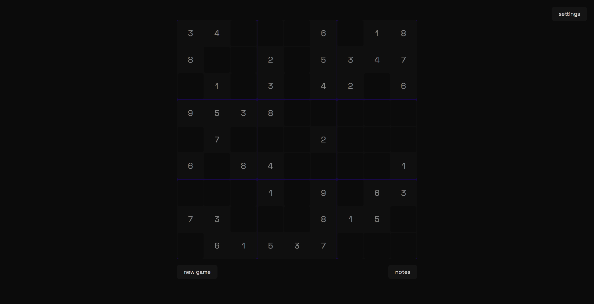

# Sudoku Clone

## Preview

<!-- <p align="center">
  
</p> -->
<p align="center">
  
</p>

## Features

- Notes
- keypad
- dark / light mode
- customisation
  - font
  - theme colours

## Todo

- [x] make it work
- [x] notes
- [x] number pad
- [x] font changer
- [x] theme changer
- [x] font size changer
- [x] add icons
- [x] write tests
- [ ] do something when win
- [ ] refactor

## setup

To run this project locally, you will need to have Node.js and npm installed.

1.  Clone the repository:

    ```bash
    git clone https://github.com/BigBadBodyPillow/sudoku-clone.git
    ```

2.  Navigate to the project directory:

    ```bash
    cd sudoku-clone
    ```

3.  Install the dependencies:

    ```bash
    npm install
    ```

4.  Start the dev server:

    ```bash
    npm run dev
    ```

## tools used

- [react colorful](https://github.com/omgovich/react-colorful)
- [svgrepo](https://www.svgrepo.com/)
